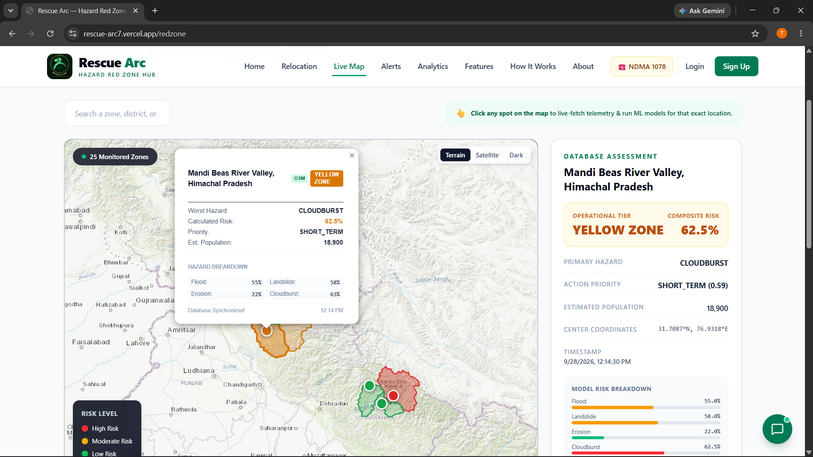
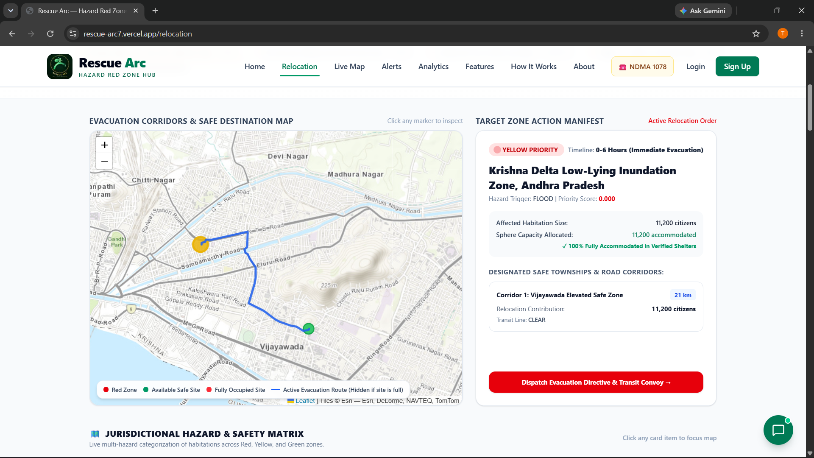
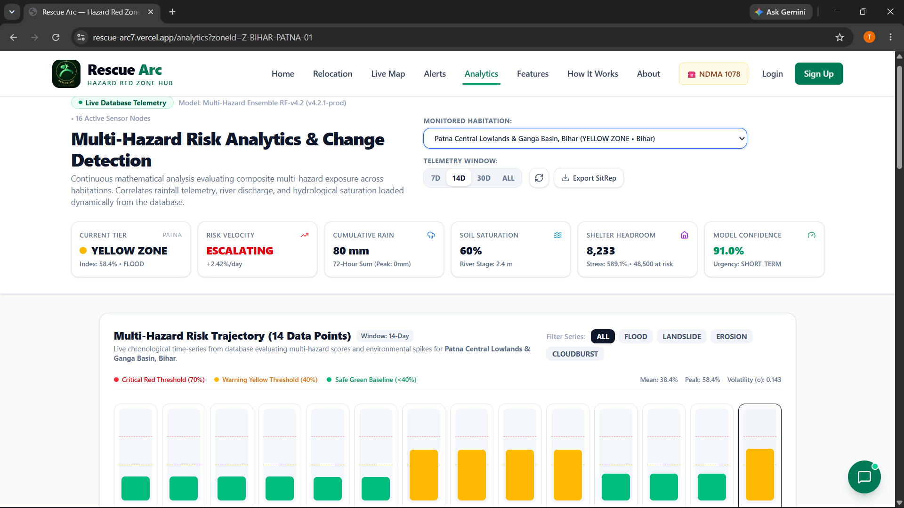
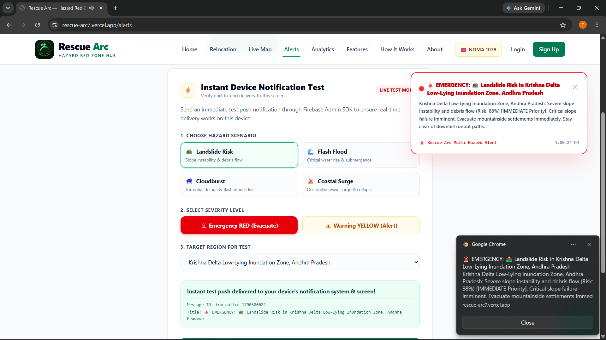
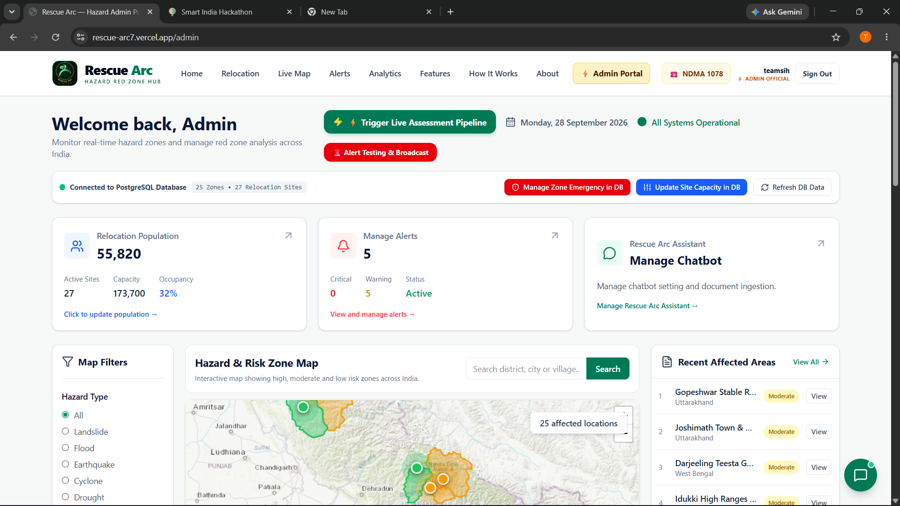
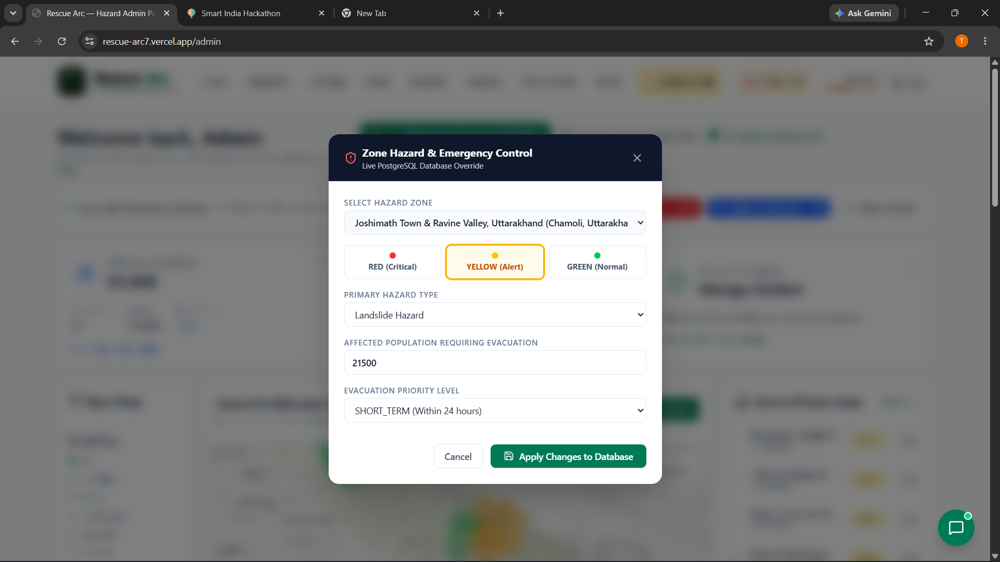
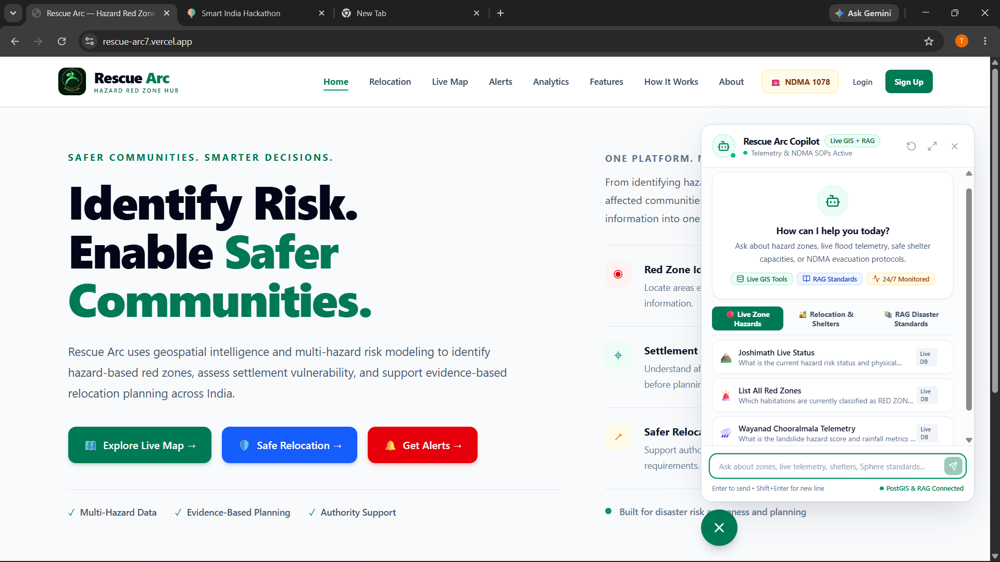

# RESCUE ARC — Intelligent Hazard-Based Red Zone Classification, Carrying Capacity Assessment & Relocation Platform

> **SIH 2026 Submission** | Problem Solution: Intelligent Identification of Hazard-Based Red Zones, Carrying Capacity Assessment, and Immediate Relocation Needs for Vulnerable Habitations (Problem Statement 26191)  
> **Team:** Team Rescue-Arc  
> **Platform:** Rescue Arc (Multi-Hazard GIS Ingestion, Machine Learning Risk Inference, Multi-Channel Alerting & Evacuation Relocation Engine)  


---

### 🔗 Live Platform & Solution Video

> 🚀 **Live Production Platform**: [https://rescue-arc7.vercel.app/](https://rescue-arc7.vercel.app/)  
> 📺 **Video Explanation & Solution Walkthrough**: [https://www.youtube.com/watch?v=7krJNtkU9Fw](https://www.youtube.com/watch?v=7krJNtkU9Fw)

[](https://rescue-arc7.vercel.app/)
[](https://www.youtube.com/watch?v=7krJNtkU9Fw)

---

## 🎯 What This Platform Does

Rescue Arc transforms national disaster management from **reactive disaster relief** into **proactive, AI-powered geospatial decision-support**. It continuously ingests real-time meteorological, hydrological, and geophysical telemetry across vulnerable habitations (including high-risk pilot zones such as Wayanad, Joshimath, Patna, Guwahati, Puri, and arbitrary user-selected coordinates) using a multi-hazard machine learning ensemble to:

-   
  **Classify** habitations dynamically into objective risk color tiers ( **$\ge 0.70$**,  **$0.40–0.69$**,  **$< 0.40$**) across 4 critical hazards: **Floods**, **Landslides**, **Coastal Erosion**, and **Cloudbursts**.

-   
  **Assess Carrying Capacity** of candidate relocation shelters evaluated against international **Sphere Project Standards** (**$45\text{ m}^2/\text{person}$** in emergency settlements) with real-time occupancy limits and structural viability validation.

-   
  **Plan Evacuation Relocation** by algorithmically matching vulnerable populations in Red and Yellow zones to the nearest safe destinations via **OSRM turn-by-turn road corridors** with automated transit time and capacity deficit calculations.

-   
  **Broadcast Multi-Channel Early Warnings** via **Firebase Cloud Messaging (FCM)** Web Push notifications, **Fast2SMS** direct mobile alerts, and **Brevo** emergency email broadcasts on critical zone transitions.

-   
  **Deliver On-Demand GIS Telemetry** via an interactive **"Click Anywhere to Analyze"** map interface pulling live satellite readings (rainfall, discharge, slope, soil moisture) within milliseconds.

-   
  **Provide Disaster Decision Support** through an AI Knowledge Assistant powered by **Llama 3.3 70B / Gemini** with RAG over NDMA standard operating procedures and live database context injection.

-   
  **Empower Disaster Authorities** (NDRF, SDMA, DDMA) with an Admin Command Portal to manage emergency states, shelter capacity, and manual overrides.

---

## 📊 SIH Outcome Coverage

| Outcome | Description | Status |
|---|---|---|
| **a** | Multi-Hazard Machine Learning Risk Models | ✅ 4 Specialized Random Forest Regressors (Flood $R^2$: 0.9578, Landslide $R^2$: 0.9010, Erosion $R^2$: 0.9710, Cloudburst $R^2$: 0.9879). |
| **b** | Hazard-Based Red Zone Classification Engine | ✅ Normalized risk scoring (0.000–1.000) with color-tier categorisation (RED, YELLOW, GREEN) achieving 88.5%–96.5% color accuracy. |
| **c** | Settlement Carrying Capacity Framework | ✅ Sphere Standards ($45\text{ m}^2/\text{person}$), real-time occupancy tracking, water source, hospital proximity, and power grid status. |
| **d** | Immediate Relocation Decision Support System (DSS) | ✅ Multi-factor priority ranking (Immediate, Short-Term, Medium-Term) with automated OSRM road distance, transit time, and shortfall calculations. |
| **e** | Multi-Source Live GIS Ingestion Pipeline | ✅ Live queries to 9+ authoritative sources: Open-Meteo, GloFAS, NASA POWER, Open-Elevation, OpenStreetMap Overpass & Nominatim. |
| **f** | Multi-Channel Automated Early Warning System | ✅ Automated triggers on Green ➔ Yellow and Yellow ➔ Red status transitions via Firebase Web Push, SMS, and emergency email broadcasts. |
| **g** | Interactive Geospatial Map & Real OSM Boundaries | ✅ Leaflet-powered GIS interface with verified OpenStreetMap GeoJSON boundary polygons and on-demand coordinate telemetry. |
| **h** | RAG-Enabled Disaster SOP & Guidelines Copilot | ✅ Groq / Gemini LLM with pgvector / ChromaDB embeddings over NDMA disaster management manuals and live database context. |
| **i** | Responder Command Portal & Deployment Architecture | ✅ Role-based authority portal for NDRF/SDMA/DDMA, zero-latency database architecture (Supabase), and Docker deployment. |

**Technical Dimensions:**
- **Dim A (Data & ML Pipeline):** Continuous live satellite and GIS ingestion, 4-hazard Random Forest regressors + Analytical Hierarchy Process (AHP) fallback, 3-tier imputation and inland guardrails.
- **Dim B (Relocation DSS & Optimization):** Mathematical modeling of environmental carrying capacity under humanitarian Sphere Standards, OSRM shortest-safe road routing, and capacity deficit alerts.
- **Dim C (Governance & Operational Telemetry):** Zero-latency snapshot-first PostgreSQL database (Supabase), real OSM boundary polygons, multi-channel broadcast service, and role-based authority consoles.

---

## 🖥️ Platform Interfaces & Key Modules

Rescue Arc provides a unified, interactive web platform for multi-hazard disaster monitoring, risk triage, and predictive relocation planning. Below is a comprehensive overview of the core platform interfaces:

### 1. Interactive Live Zone Map (Click-to-Analyze Telemetry)


1. **Page Description:** Real-time GIS mapping console rendering verified OpenStreetMap administrative boundary polygons for monitored zones, color-coded by real-time ML risk severity (Red, Yellow, Green), complete with on-the-fly "Click Anywhere to Analyze" telemetry inspection.
2. **Function:** Enables disaster managers and citizens to inspect hazard risk at any arbitrary GPS coordinate, view live meteorological and hydrological readings (rainfall, discharge, slope, soil moisture), and monitor spatial hazard boundaries across districts.

### 2. Relocation Engine & Evacuation Route Planning


1. **Page Description:** Humanitarian decision-support module that pairs endangered habitations in Red and Yellow zones to verified safe relocation shelters evaluated against international Sphere Standards ($45\text{ m}^2$ per person).
2. **Function:** Calculates total evacuee demand, assesses shelter capacity deficits/shortfalls, generates turn-by-turn road evacuation routes via OSRM, calculates transit times, and displays real-time capacity progress meters.

### 3. Live Telemetry & Multi-Hazard Sensor Dashboard


1. **Page Description:** Continuous monitoring console featuring live gauge telemetry for 24h & 72h rainfall accumulation, river discharge rates ($m^3/s$), soil saturation percentages, slope inclination angles, and historical disaster recurrence trends.
2. **Function:** Detects dangerous environmental threshold breaches before disaster events occur, displays correlation metrics between rainfall and river levels, and provides longitudinal risk time-series for trend forecasting.

### 4. Automated Alert & Multi-Channel Broadcast System


1. **Page Description:** Real-time emergency escalation and alert console that tracks zone state transitions (Green ➔ Yellow, Yellow ➔ Red) and dispatches geo-targeted emergency warnings.
2. **Function:** Dispatches Firebase Cloud Messaging (FCM) Web Push notifications to subscribed devices in affected zones, triggers Fast2SMS direct mobile alerts and Brevo email broadcasts, and maintains an auditable broadcast event log.

### 5. Official Disaster Authority & Admin Command Portal


1. **Page Description:** Role-based administrative dashboard designed for NDRF, SDMA, and DDMA officers to manage crisis operations, inspect live zones, and dispatch operational directives.
2. **Function:** Provides high-level emergency state management, 1-click disaster scenario simulation presets (e.g. Wayanad Landslide, Patna River Flood), auto-sync countdowns, audio alarm toggles, and manual override capabilities.

### 6. Zone Emergency Management & Relocation Capacity Features


1. **Page Description:** Dedicated administrative controls for configuring zone-level emergency parameters and dynamically updating safe shelter capacity allocations.
2. **Function:** Allows emergency controllers to override hazard classification states during localized crises, adjust usable shelter area, update power and water grid status, and reassign evacuation corridors on the fly.

### 7. RAG Knowledge Assistant & Disaster SOP Chatbot


1. **Page Description:** Conversational disaster management copilot powered by Llama 3.3 70B (via Groq) / Gemini with Retrieval-Augmented Generation (RAG) over official NDMA guidelines and local disaster bylaws.
2. **Function:** Answers natural language operational questions from responders and citizens, provides step-by-step standard operating procedures (SOPs) for floods, landslides, and cloudbursts, and synthesizes live hazard readings directly from the project database.

---

## 🏗 System Architecture

```
┌──────────────────────────────────────────────────────────────────────────────────┐
│                             Web Browser / Citizen / Admin                        │
└────────────────────────┬───────────────────────────────────┬─────────────────────┘
                         │ Next.js Web Traffic               │ Web Push / Alerts
┌────────────────────────▼───────────────────────────────────▼─────────────────────┐
│                    Next.js 16 Web Application (Port 3000)                        │
│  ┌────────────────────────────────────────────────────────────────────────────┐  │
│  │  Pages: / | /zones | /relocation | /analysis | /alerts | /admin | /rag     │  │
│  └────────────────────────────────────────────────────────────────────────────┘  │
│  ┌────────────────────────────────────────────────────────────────────────────┐  │
│  │  API Routes: /api/zones | /api/analyze-point | /api/v1/relocation/*         │  │
│  │              /api/alerts/* | /api/admin/* | /api/v1/rag/*                  │  │
│  └────────────────────────────────────────────────────────────────────────────┘  │
│  ┌────────────────────────────────────────────────────────────────────────────┐  │
│  │  Client Modules: Leaflet GIS Maps | OSRM Route Display | Live Gauges       │  │
│  │                  tRPC & TanStack Query | Floating Emergency Toast Pill     │  │
│  └────────────────────────────────────────────────────────────────────────────┘  │
│                    │ Prisma ORM / PostGIS              │ HTTP Proxy              │
└────────────────────┼───────────────────────────────────┼─────────────────────────┘
                     │                                   │
          ┌──────────▼──────────────┐         ┌──────────▼──────────────────────┐
          │  Supabase (PostgreSQL)  │         │  FastAPI ML & GIS Service       │
          │  • Zone & Polygon Cache │         │  (Port 8000 / 10000)            │
          │  • HazardReadings       │         │  • 4 Random Forest Regressors   │
          │  • RelocationSites      │         │  • AHP Decision Engine          │
          │  • RelocationPlans      │         │  • OSRM Routing Engine          │
          │  • rag_documents        │         │  • APScheduler Live Sync Cron   │
          │  • alert_log            │         │  • FCM / Fast2SMS / Brevo       │
          └─────────────────────────┘         └─────────────────┬───────────────┘
                                                                │
                                   ┌────────────────────────────┴─────────────────┐
                                   │           External Authority Feeds           │
                                   │  • Open-Meteo & GloFAS River Forecast        │
                                   │  • NASA POWER & SoilGrids                    │
                                   │  • Open-Elevation SRTM & OSM Overpass        │
                                   │  • Groq (Llama 3.3 70B) / Google Gemini API  │
                                   │  • Firebase Cloud Messaging (FCM)            │
                                   └──────────────────────────────────────────────┘
```

---

## 🤖 ML Architecture

```
Live GIS APIs (Open-Meteo, GloFAS, NASA POWER, Open-Elevation, OSM)
         │
Data Cleaning, Normalization & Guardrail Layer (cleaning.py & ml_predictor.py)
  ├─ Topographical: elevation_m, slope_deg, land_cover_type
  ├─ Hydrological: rainfall_mm_24h, rainfall_mm_72h, river_discharge_m3s, river_level_change_rate
  ├─ Soil & Geospatial: soil_saturation_pct, distance_to_river_m, distance_to_coast_m
  ├─ Historical: recurrence counts (flood, landslide, erosion, cloudburst)
  └─ Guardrails: Inland coastal guardrail (auto-zero erosion for non-coastal terrain)
         │
Pre-trained Ensemble Regressors & Classifiers (scikit-learn / joblib)
  ┌──────────────────┬──────────────────┬──────────────────┬──────────────────┐
  │      FLOOD       │    LANDSLIDE     │     EROSION      │    CLOUDBURST    │
  │  Random Forest   │  Random Forest   │  Random Forest   │  Random Forest   │
  │    R²: 0.9578    │    R²: 0.9010    │    R²: 0.9710    │    R²: 0.9879    │
  │   Acc: 96.5%     │   Acc: 88.5%     │   Acc: 94.0%     │   Acc: 92.0%     │
  └──────────────────┴──────────────────┴──────────────────┴──────────────────┘
         │
AHP Decision Fallback Engine (Analytical Hierarchy Process / Saaty Pairwise Matrix)
         │
Objective Hazard Scoring (0.000 – 1.000) & Zone Color Classification
  ├─ RED ALERT      : Worst hazard score ≥ 0.70  ➔ Immediate Evacuation
  ├─ YELLOW WARNING : Worst hazard score 0.40–0.69 ➔ Structural Alert & Standby
  └─ GREEN SAFE     : Worst hazard score < 0.40  ➔ Routine Monitoring
         │
Priority Urgency Computation (w_h·Score + w_p·Population + w_s·Vulnerability + w_d·History)
         │
Sphere-Standard Relocation Engine (45 sqm/person shelter matching + OSRM road routing)
```

---

## 📁 Repository Structure

```
sih-main/
├── README.md                                  # Platform documentation (This file)
├── END_TO_END_DEPLOYMENT_AND_TESTING_GUIDE.md  # Comprehensive deployment & test runbook
├── INSIGHTS_README.md                         # Detailed ML verification & data insights
├── SHOWING_rEAL_BOUNDARY_MAP.md               # OSM boundary polygon documentation
├── package.json                               # Monorepo root package configuration
├── pnpm-workspace.yaml                        # PNPM workspace definition
├── turbo.json                                 # Turborepo task pipeline configuration
├── docker/
│   └── docker-compose.yml                     # Local PostgreSQL database container
│
├── packages/
│   ├── database/
│   │   ├── prisma/
│   │   │   └── schema.prisma                  # Prisma schema: Zone, RelocationSite, etc.
│   │   └── package.json
│   ├── types/                                 # Shared TypeScript interfaces & types
│   └── config/                                # Shared TypeScript & ESLint configurations
│
├── frontend/
│   ├── package.json                           # Next.js 16, React 19, Tailwind v4, Leaflet
│   ├── public/                                # Public assets & platform screenshot previews
│   │   ├── livemap.png                        # Live Zone Map preview
│   │   ├── relocationpage.png                 # Relocation Engine preview
│   │   ├── analysispage.png                   # Telemetry & Sensor dashboard preview
│   │   ├── alertspage.png                     # Multi-channel alert console preview
│   │   ├── adminpage.png                      # Admin command portal preview
│   │   ├── admin-zonefeature.png              # Admin zone override controls
│   │   ├── admin-capacityfeature.png          # Relocation site capacity feature
│   │   └── ragchatbot.png                     # RAG assistant preview
│   └── src/
│       ├── app/
│       │   ├── page.jsx                       # / — Single-page auto-scroll home portal
│       │   ├── (marketing)/
│       │   │   ├── zones/                     # /zones — Interactive Live Zone GIS Map
│       │   │   ├── relocation/                # /relocation — Sphere Relocation Engine
│       │   │   ├── analysis/                  # /analysis — Live Multi-Hazard Telemetry
│       │   │   ├── alerts/                    # /alerts — Automated Broadcast Console
│       │   │   └── admin/                     # /admin — Official Authority Command Portal
│       │   └── api/                           # Next.js API routes & proxy handlers
│       └── components/
│           ├── map/                           # Leaflet map & GeoJSON boundary layers
│           ├── marketing/                     # Home sections, Hero, Navbar, Footer
│           └── ui/                            # Reusable UI widgets & emergency toasts
│
└── backend-main/
    ├── main.py                                # Unified FastAPI application entry point
    ├── requirements.txt                       # Core Python backend dependencies
    ├── Dockerfile                             # Container build definition for backend
    ├── backend/
    │   ├── routers/                           # FastAPI routers (habitations, etc.)
    │   ├── app/
    │   │   ├── api/routes/rag.py              # RAG SSE streaming chat endpoints
    │   │   └── rag/                           # ChromaDB / pgvector RAG implementation
    │   └── GIS-Scripts-FETCH-API-layer/
    │       ├── hazard_platform/
    │       │   ├── pipeline_runner.py         # Batch GIS ingestion & scoring pipeline
    │       │   ├── zones.py                   # Monitored pilot zones registry
    │       │   ├── data_pipeline/             # Live fetchers for Open-Meteo, GloFAS, NASA
    │       │   └── ml_service/
    │       │       ├── inference/             # ML predictor & AHP weighting engines
    │       │       └── ml_training/           # Training scripts & model weights (.joblib)
    │       └── rescue_arc_alert/
    │           ├── alert_service.py           # FCM Web Push, SMS, and email broadcasting
    │           └── test_alert_system.py       # Automated alert test suite (22 tests)
```

---

## 🚀 Local Setup (Windows PowerShell)

### Prerequisites
- **Node.js**: `20.x` or `22.x` (LTS)
- **Package Manager**: `pnpm` (`v9.x` or `v10.x`) — install via `npm i -g pnpm`
- **Python**: `3.10` to `3.13` (64-bit)
- **Git**: Installed and available in PATH

### Step 1 — Install Frontend & Workspace Dependencies
Run from the repository root (`sih-main/`):
```powershell
pnpm install
pnpm approve-builds
```
*(When prompted, approve `@prisma/client`, `@prisma/engines`, `prisma`, and `sharp`).*

### Step 2 — Configure Environment Variables
Verify or create the respective `.env` files:

**1. `sih-main/.env` and `sih-main/packages/database/.env`:**
```env
DATABASE_URL="postgresql_database_url"
DIRECT_URL="postgresql_database_url"
NEXTAUTH_SECRET="sih-rescue-arc-super-secret-key-32-chars-min"
NEXTAUTH_URL="http://localhost:3000"
NEXT_PUBLIC_APP_URL="http://localhost:3000"
```

**2. `sih-main/frontend/.env.local`:**
```env
DATABASE_URL="postgresql_database_url"
DIRECT_URL="postgresql_database_url"
ML_SERVICE_URL="http://localhost:8000"
ML_SERVICE_API_KEY="rescue-arc-internal-key"
NEXTAUTH_SECRET="sih-rescue-arc-super-secret-key-32-chars-min"
NEXTAUTH_URL="http://localhost:3000"
```

**3. `backend-main/.env`:**
```env
DATABASE_URL="postgresql_database_url"
INTERNAL_API_KEY="rescue-arc-internal-key"
GROQ_API_KEY="your-groq-api-key"
LLM_MODEL="llama-3.3-70b-versatile"
EMBEDDING_MODEL="sentence-transformers/all-MiniLM-L6-v2"
```

### Step 3 — Generate Prisma Database Client
```powershell
pnpm db:generate
```

### Step 4 — Set Up Python Backend Virtual Environment
Open a terminal in `backend-main/`:
```powershell
cd backend-main
python -m venv .venv
.\.venv\Scripts\Activate.ps1
pip install -r requirements.txt
```

### Step 5 — Start Python Backend & ML Service
With `.venv` active in `backend-main/`:
```powershell
uvicorn main:app --reload --port 8000
```
- Interactive API Docs (Swagger UI): http://localhost:8000/docs
- Health Check: http://localhost:8000/health

### Step 6 — Start Next.js Frontend
In a separate terminal, from `sih-main/`:
```powershell
pnpm dev
```
Open: http://localhost:3000

---

## 🐳 Docker Deployment

To spin up the local supporting PostgreSQL instance or containerized services:

```powershell
# Start local PostgreSQL database container
docker compose -f docker/docker-compose.yml up -d

# Build and run Python backend container
cd backend-main
docker build -t rescue-arc-backend .
docker run -p 8000:8000 --env-file .env rescue-arc-backend
```

---

## 🔧 API Reference

### Next.js Frontend API Routes

| Endpoint | Method | Description |
|---|---|---|
| `/api/zones` | GET | Returns all monitored zones with live hazard color classifications |
| `/api/analyze-point` | GET / POST | On-the-fly GIS satellite query and ML prediction for any `lat`/`lon` |
| `/api/v1/relocation/plans` | GET | Returns active relocation plans, allocated shelters, and road routes |
| `/api/v1/relocation/sites` | GET / POST | Retrieves or creates Sphere-standard safe relocation shelters |
| `/api/admin/override-zone` | POST | Manually overrides a zone's hazard status (Red / Yellow / Green) |
| `/api/admin/reset-all` | POST | Resets all zones back to normal monitoring status |
| `/api/alerts/history` | GET | Fetches recent broadcast logs and delivery audit metrics |

### FastAPI Backend API Routes

| Endpoint | Method | Description |
|---|---|---|
| `/health` | GET | System health check (database status and alert bridge state) |
| `/api/zone-boundaries` | GET | Returns real OpenStreetMap GeoJSON boundary polygons |
| `/api/known-zones` | GET | Monitored pilot zones enriched with ML scores and OSM boundaries |
| `/api/pipeline/trigger-all` | POST | Manually triggers live GIS fetching, ML inference, and DB refresh |
| `/api/pipeline/status` | GET | Returns execution status and rate-limit cooldown remaining |
| `/api/v1/rag/chat` | POST | SSE streaming disaster guideline Q&A powered by Groq / Gemini |
| `/api/v1/rag/ingest` | POST | Ingests NDMA SOP documents or disaster bylaws into vector storage |
| `/subscribe` | POST | Registers a citizen device token and GPS coordinates for push alerts |
| `/admin/override-zone` | POST | Simulates emergency state transition and dispatches push alerts |
| `/docs` | GET | Swagger UI documentation with interactive schema testing |

---

## 🌡 Environment Variables

| Variable | Required | Description |
|---|---|---|
| `DATABASE_URL` | **Yes** | PostgreSQL connection string for Supabase with PostGIS |
| `DIRECT_URL` | **Yes** | Direct database connection string bypassing connection poolers |
| `INTERNAL_API_KEY` | **Yes** | Secret handshake key between Next.js frontend and Python backend |
| `ML_SERVICE_URL` | **Yes** | Base URL of the running FastAPI service (`http://localhost:8000`) |
| `GROQ_API_KEY` | Optional | Enables ultra-fast Llama 3.3 70B inference for RAG Copilot |
| `GEMINI_API_KEY` | Optional | Fallback LLM inference provider for conversational assistance |
| `FIREBASE_SERVICE_ACCOUNT_PATH` | Optional | Path to Firebase credentials for real Web Push notifications |
| `NEXTAUTH_SECRET` | **Yes** | Cryptographic session signing key for NextAuth authentication |
| `NEXTAUTH_URL` | **Yes** | Canonical frontend URL (`http://localhost:3000`) |

---

## 🧠 Retrain ML Models

To retrain the 4 specialized Random Forest hazard models with updated training datasets:

```powershell
cd backend-main\backend\GIS-Scripts-FETCH-API-layer\hazard_platform\ml_training
python train_hazard_models.py
```

This retrains all 4 hazard regressors and zone classifiers (Flood, Landslide, Coastal Erosion, Cloudburst), validates performance against test splits, and updates `training_summary.csv` and the serialized `.joblib` model weights in `ml_service/inference/trained_models/`.

---

## ⚠️ Data Provenance

| Data Source | Type | Provider / Description |
|---|---|---|
| **Meteorological & Weather** | **Live** | Open-Meteo Weather API (`rainfall_mm_24h`, `72h`, temperature, humidity, wind) |
| **Hydrological & Discharge** | **Live** | Open-Meteo GloFAS API (`river_discharge_m3s`, river level rate of change) |
| **Soil Moisture & Saturation** | **Live** | NASA POWER & SoilGrids (`soil_saturation_pct`, root-zone soil moisture) |
| **Topography & Elevation** | **Live** | Open-Elevation & USGS SRTM (`elevation_m`, computed `slope_deg`) |
| **Geospatial & Boundaries** | **Live** | OpenStreetMap Nominatim & Overpass API (distance to rivers/coasts, boundary GeoJSON) |
| **Historical Recurrence** | **Benchmark** | NDMA & GSI localized disaster recurrence frequencies |
| **Relocation Standards** | **Standard** | The Sphere Project: Humanitarian Charter and Minimum Standards in Disaster Response |

---

## 📚 Technology Stack

| Layer | Technologies |
|---|---|
| **Frontend Framework** | Next.js 16 (App Router, Turbopack), React 19, TypeScript |
| **Styling & Components** | Tailwind CSS v4, Lucide React, Glassmorphism UI, Emergency Pill Toasts |
| **Geospatial & Maps** | Leaflet, React-Leaflet, OpenStreetMap GeoJSON Polygons, OSRM Road Routing |
| **Backend & APIs** | Python 3.11+, FastAPI, Uvicorn, Pydantic, APScheduler |
| **Database & ORM** | Supabase (Cloud PostgreSQL), PostGIS Geometry, Prisma ORM, Prisma Client |
| **Machine Learning** | scikit-learn, Random Forest Regressors, Joblib, AHP Decision Matrix |
| **Generative AI & RAG** | Groq (Llama 3.3 70B), Gemini Flash, Sentence-Transformers, pgvector / ChromaDB |
| **Alerting & Push** | Firebase Cloud Messaging (FCM Web Push), Fast2SMS, Brevo Email |
| **Package Management** | PNPM Workspaces, Turborepo |

---

The Rescue Arc solution directly addresses all expected technical dimensions and outcomes of Smart India Hackathon Problem Statement 26191 by integrating real-time GIS telemetry, scientific machine learning ensembles, international Sphere humanitarian standards, and multi-channel disaster alert dissemination into a unified, zero-latency platform.
