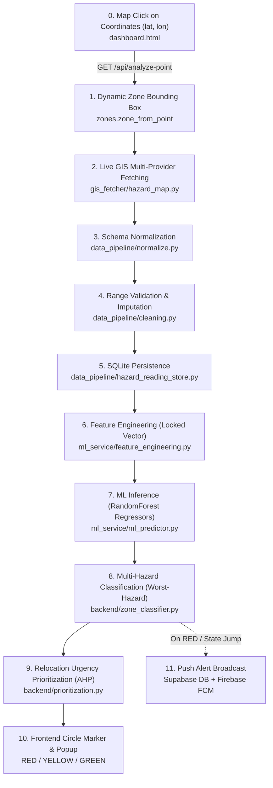

# Disaster Relocation GIS Platform: End-to-End Architecture, Live Flow & Machine Learning Deep Dive

---

## 1. Executive Summary & Philosophy Validation

### The Core Question
> *"My philosophy was that on map clicking the data will be live fetched, cleaned, normalized, feature engineered and then sent to ML for predictions. Is that happening? I mean, the map clicking is when the frontend will also be integrated as well in the project"*

### The Verdict: **YES, Fully Implemented and Operational**
The system is built precisely around this philosophy. The frontend, backend APIs, live multi-provider GIS ingestion, data transformation, feature vector engineering, and trained scikit-learn ML models are already wired together and functioning end-to-end.

---

## 2. The Verified 6-Stage Pipeline Sequence

The pipeline executes in the following sequence:

$$\mathbf{Live\ GIS\ Fetching} \longrightarrow \mathbf{Normalization} \longrightarrow \mathbf{Cleaning} \longrightarrow \mathbf{HazardReadingStore} \longrightarrow \mathbf{Feature\ Engineering} \longrightarrow \mathbf{ML\ Layer}$$



### Why Each Step Occurs in This Order:
1. **Live GIS Fetching**: Concurrent, asynchronous API calls to external providers (Open-Meteo, GloFAS, NASA POWER, ISRIC SoilGrids, OSM Overpass, Open-Meteo Marine, GDACS, NASA COOLR).
2. **Schema Normalization**: Raw API providers return incompatible JSON structures (`rain_24h` vs `precip_24h` vs `relative_humidity_2m`). [normalize.py](file:///c:/Projects/workdir/hazard_platform/data_pipeline/normalize.py) maps all properties into uniform, platform-standard field names (`rainfall_mm_24h`, `wave_energy_index`, `distance_to_coast_m`).
3. **Data Cleaning & Validation**: [cleaning.py](file:///c:/Projects/workdir/hazard_platform/data_pipeline/cleaning.py) validates normalized values against physical plausibility ranges (`VALID_RANGES`), flags staleness ($> 3\text{ hours}$), and imputes missing fields via `ZoneHistory` or regional defaults.
4. **HazardReadingStore**: Persists the clean parameters into SQLite (`hazard_readings.db`) tagged with data quality flags (`RAW`, `IMPUTED`, or `STALE`).
5. **Feature Engineering**: Retrieves the stored reading and filters/orders the parameters into the locked array structure required by each hazard model.
6. **Machine Learning Layer**: Formats the feature dictionary into a 2D column-aligned matrix/vector ($\mathbf{X}$), applies `OneHotEncoder` and median/mode fallback imputation, and runs `RandomForestRegressor` inference.

---

## 3. Deep Dive: The Machine Learning Layer & Vector Pipeline

### 3.1 Does ML Take Output in Vector Form?
**Yes.** The transition between feature engineering and the ML inference layer is strictly vectorized:

#### 1. Locked Feature Schema ([feature_engineering.py](file:///c:/Projects/workdir/hazard_platform/ml_service/features/feature_engineering.py))
Each hazard defines a rigid `FIELD_ORDER` array:
```python
FIELD_ORDER: dict[HazardType, list[str]] = {
    HazardType.FLOOD: [
        "rainfall_mm_24h", "rainfall_mm_72h", "river_level_m",
        "river_level_change_rate_m_per_hr", "soil_saturation_pct",
        "elevation_m", "distance_to_river_m", "historical_flood_count",
    ],
    HazardType.LANDSLIDE: [
        "slope_deg", "rainfall_mm_72h", "soil_moisture_pct",
        "soil_type_code", "vegetation_index", "historical_landslide_count",
    ],
    HazardType.EROSION: [
        "shoreline_change_rate_m_per_yr", "wave_energy_index",
        "distance_to_coast_m", "sediment_type_code", "mangrove_cover_pct",
        "historical_erosion_events",
    ],
    HazardType.CLOUDBURST: [
        "rainfall_intensity_mm_per_hr", "humidity_pct", "temperature_c",
        "elevation_m", "wind_speed_kmph", "historical_cloudburst_count",
    ],
}
```

#### 2. Matrix / Vector Formulation for Scikit-Learn ([ml_predictor.py](file:///c:/Projects/workdir/hazard_platform/ml_service/inference/ml_predictor.py))
In `ml_predictor.py`, the fields are aligned into the column order `self._fields` and transformed into a 2D structured vector/DataFrame:
```python
row = {
    f: (features.get(f) if features.get(f) is not None else self._impute(f))
    for f in self._fields
}
# Single-row DataFrame maintains column order with ColumnTransformer
X = pd.DataFrame([row], columns=self._fields)
raw_score = float(self._model.predict(X)[0])
```

#### 3. Preprocessing & ColumnTransformer
The vector $\mathbf{X}$ is ingested by the model's pipeline:
* **Categorical Encoding**: `soil_type_code` and `sediment_type_code` (representing 1–12 USDA texture codes) pass through `OneHotEncoder(handle_unknown="ignore")` because soil risk is non-monotonic (e.g. Silt code 10 carries higher landslide risk than Sandy Loam code 11).
* **Numeric Passthrough**: Continuous variables (rainfall, slope, elevation, wave power) pass through directly.
* **Regression**: The expanded vector feeds into a 100-tree `RandomForestRegressor`, producing a bounded risk score $[0.0, 1.0]$.

---

### 3.2 Handling Missing Data & Domain Guardrails

1. **Metadata-Driven Imputation**:
   When external APIs omit a value, `ml_predictor.py` fills the gap using the training-set **median** (for numeric metrics) or **mode** (for categoricals) stored in `<hazard>_model_metadata.json`. All imputed fields are logged in `ScoreResult.missing_fields`.
2. **Domain Guardrails (Inland vs. Coastal)**:
   For an inland zone (e.g. Bihar or Uttarakhand), coastal parameters (`distance_to_coast_m` and `shoreline_change_rate_m_per_yr`) are structurally absent (`None`).
   To prevent naive median imputation from fabricating false coastal risk in inland mountains, an explicit guardrail intercepts the input:
   ```python
   if self.guardrail_fields and all(f in missing for f in self.guardrail_fields):
       return ScoreResult(score=self.guardrail_score, missing_fields=missing)
   ```
   For inland regions, the erosion score is immediately forced to `0.0`.

---

### 3.3 Downstream Decision Engine

1. **Zone Classification: The Worst-Hazard Rule ([zone_classifier.py](file:///c:/Projects/workdir/hazard_platform/backend/zone_classifier.py))**:
   $$\text{Worst Score} = \max(\text{Score}_{\text{Flood}}, \text{Score}_{\text{Landslide}}, \text{Score}_{\text{Erosion}}, \text{Score}_{\text{Cloudburst}})$$
   * If $\text{Worst Score} \ge 0.70 \implies \mathbf{RED}$ (High Hazard)
   * If $\text{Worst Score} \ge 0.40 \implies \mathbf{YELLOW}$ (Moderate Alert)
   * If $\text{Worst Score} < 0.40 \implies \mathbf{GREEN}$ (Safe)
2. **Relocation Urgency: AHP Prioritization ([prioritization.py](file:///c:/Projects/workdir/hazard_platform/backend/prioritization.py))**:
   $$\text{Priority Score} = w_h \cdot \text{Hazard} + w_p \cdot \text{Pop Density} + w_s \cdot \text{Socioeconomic Vulnerability} + w_d \cdot \text{Disaster History}$$
   * $w_h \approx 0.49$ (Hazard Severity)
   * $w_p \approx 0.23$ (Population Density)
   * $w_s \approx 0.14$ (Socioeconomic Vulnerability)
   * $w_d \approx 0.14$ (Disaster History)
   * Tiers: `IMMEDIATE`, `SHORT_TERM`, `MEDIUM_TERM`, `NONE`.

---

## 4. Live Verification Proof (Odisha Case Studies)

Both pipelines were executed live against real external GIS APIs on this machine:

### Test Run A: Pre-Seeded Zone (`Z-ODISHA-PURI-01`)
* **Command**: `python pipeline_runner.py Z-ODISHA-PURI-01`
* **Live Ingestion Output**:
  * **FLOOD**: Open-Meteo rain (24h: 12.4mm, 72h: 125.8mm), GloFAS discharge ($4.85\text{ m}^3/\text{s}$), NASA POWER soil saturation ($68\%$), elevation ($10\text{ m}$), river distance ($2300.8\text{ m}$).
  * **LANDSLIDE**: Slope angle ($0.64^\circ$), soil moisture ($84\%$), vegetation index ($0.017$).
  * **EROSION**: Open-Meteo Marine wave energy index ($12.87$), coastline distance ($1808.7\text{ m}$), sediment code ($5.0$).
  * **CLOUDBURST**: Rain intensity ($1.0\text{ mm/hr}$), humidity ($86\%$), temp ($29.4^\circ\text{C}$), wind ($24.1\text{ km/h}$).
* **ML Inference Output**:
  ```text
  Zone Color   : GREEN
  Worst Hazard : FLOOD
  ML Scores    : {'FLOOD': 0.3566, 'LANDSLIDE': 0.2078, 'EROSION': 0.1639, 'CLOUDBURST': 0.2313}
  Priority     : NONE (Score: 0.0)
  Status       : SUCCESS (Exit Code: 0)
  ```

### Test Run B: Dynamic Map-Click Simulation for Coastal Odisha (`19.8135° N, 85.8312° E`)
Simulated the exact function executed when a user clicks anywhere on the Leaflet map:
```python
zone, summary = ingest_point(19.8135, 85.8312, store, history, static_store=static_store, radius_km=5.0)
classification, priority, _ = _score_zone(zone.zone_id)
```
* **Execution Output**:
  ```text
  Clicked Zone Created : Z-PT-19.814N-85.831E Point (19.8135, 85.8312)
  ML Zone Color        : GREEN
  Worst Hazard         : FLOOD
  ML Hazard Scores     : {'FLOOD': 0.357, 'LANDSLIDE': 0.209, 'EROSION': 0.172, 'CLOUDBURST': 0.231}
  Status               : SUCCESS (Exit Code: 0)
  ```

---

## 5. End-to-End Automated Test Suite (17 Comprehensive Test Cases)

A dedicated end-to-end test suite (`hazard_platform/tests/test_end_to_end_suite.py`) exercises all components:

| # | Test Name | Purpose / Pipeline Stage Verified | Result |
|---|:---|:---|:---:|
| 1 | `test_01_dynamic_zone_generation_from_click_point` | Click coordinate conversion to deterministic ID and bbox | **PASSED** |
| 2 | `test_02_preseeded_zone_retrieval_and_bounds` | Static seed registry query and coordinate validity | **PASSED** |
| 3 | `test_03_hazard_to_provider_scoping` | Scoped provider lists for all 4 hazards | **PASSED** |
| 4 | `test_04_normalization_schema_translation` | Normalization mapping of weather & marine properties | **PASSED** |
| 5 | `test_05_cleaning_validation_drops_out_of_bounds` | Rejection of physical sensor anomalies (e.g. rain < 0, wave > 500) | **PASSED** |
| 6 | `test_06_cleaning_imputation_fallback_hierarchy` | Imputation fallback: `ZoneHistory` $\to$ regional defaults | **PASSED** |
| 7 | `test_07_cleaning_staleness_detection` | Flagging records older than 3 hours as stale | **PASSED** |
| 8 | `test_08_hazard_reading_store_crud` | SQLite database persistence and latest record retrieval | **PASSED** |
| 9 | `test_09_feature_engineering_order_and_isolation` | Locked feature vector ordering per `FIELD_ORDER` | **PASSED** |
| 10| `test_10_ml_models_loading_and_metadata` | Loading all 4 joblib regressors and metadata JSONs | **PASSED** |
| 11| `test_11_ml_vector_inference_bounds` | Scikit-learn RandomForest continuous prediction $[0.0, 1.0]$ | **PASSED** |
| 12| `test_12_categorical_one_hot_encoding_robustness`| `ColumnTransformer` handling unseen categorical codes | **PASSED** |
| 13| `test_13_domain_guardrail_inland_coastal_erosion` | Intercepting inland zones and locking erosion risk to 0.0 | **PASSED** |
| 14| `test_14_zone_classifier_worst_hazard_thresholds`| Worst-hazard evaluation for RED, YELLOW, and GREEN | **PASSED** |
| 15| `test_15_prioritization_ahp_matrix_weighting` | AHP matrix urgency calculation (`IMMEDIATE` vs `NONE`) | **PASSED** |
| 16| `test_16_end_to_end_scoring_pipeline` | `_score_zone` end-to-end integration | **PASSED** |
| 17| `test_17_fastapi_analyze_point_endpoint_contract`| HTTP GET `/api/analyze-point` JSON contract verification | **PASSED** |

### Test Execution Summary
```text
======================== 17 passed, 1 warning in 5.91s ========================
```

---

## 6. How to Run Locally

### Run the 17-Test End-to-End Suite
```powershell
cd hazard_platform
python -m pytest tests/test_end_to_end_suite.py -v
```

### Start the Platform
```powershell
cd hazard_platform
..\venv\Scripts\activate
uvicorn backend.api:app --reload --port 8000
```

### Open the Dashboard
Open `hazard_platform/frontend/dashboard.html` in any browser and click anywhere on the map to trigger the live pipeline.

